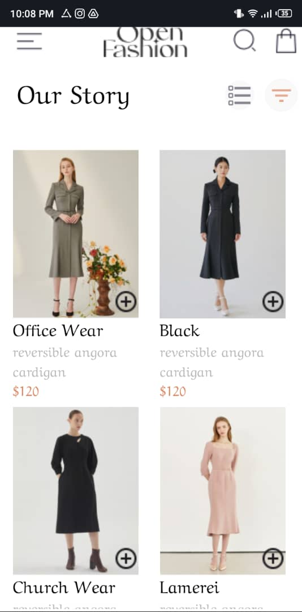
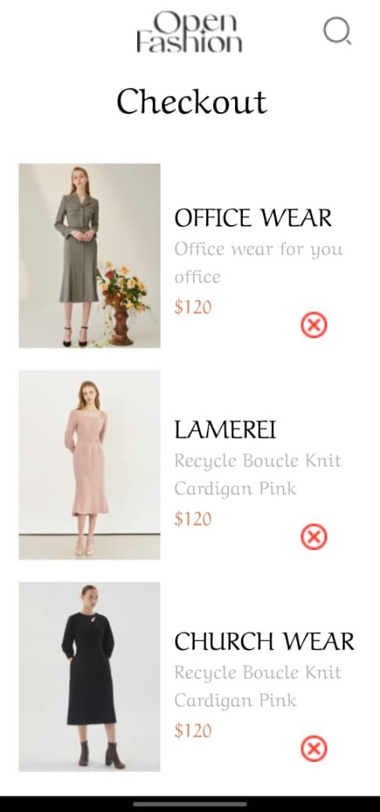

# React Native Assignment 6

This repository contains the code for the sixth assignment of my Mobile Application Development course. The task was to recreate a UI mockup and implement specific functionalities including local storage for selected items. Custom components were used throughout the application.

## Table of Contents

- [Features](#features)
- [Screenshots](#screenshots)
- [How I Built the Application](#how-i-built-the-application)
- [Design Choices](#design-choices)
- [Data Storage](#data-storage)

## Features

- Recreate the UI design as per the mockup.
- HomeScreen: Display a list of available products.
- CartScreen: Display selected items.
- Add to cart button for each product.
- Remove from cart button for each selected item.
- Use local storage (AsyncStorage, SecureStore, or FileSystem) to store selected items locally on the device.
- Users can:
  - View a list of available products.
  - Add products to their cart.
  - Remove products from their cart.
  - View the items in their cart.

## Screenshots

### Home Screen

### Cart Screen

## How I Built the Application

The application was built following the instructions of the assignment, which required recreating a given UI mockup. I started by setting up a new Expo project and installing the necessary dependencies for navigation and icons. The application features a bottom tab navigator with screens for Home and Cart. Each screen was styled to closely match the provided UI design using custom components and React Native's styling system.

## Project Description

This app is a simple e-commerce platform showcasing a catalog of items that users can add to their cart. The design focuses on simplicity and ease of use, with a clean and intuitive interface.

## Design Choices

- **Expo SecureStore**: Used for secure, local storage of cart items. This choice ensures that user cart data is persisted across app launches in a secure manner.
- **Custom Fonts with Expo Google Fonts**: To enhance the UI's look and feel, custom fonts were integrated using Expo Google Fonts. This adds a unique touch to the app's design.
- **Navigation**: The use of React Navigation for navigating between the Home and Cart screens. It's a standard choice for handling routing in React Native apps, providing a smooth and native-like transition between screens.

## Data Storage

- **Cart Items**: Stored locally using Expo's SecureStore. This ensures that the items users add to their cart are saved securely and persistently, even when the app is closed. The cart items are stored as a JSON string, which is parsed and updated whenever items are added or removed.
